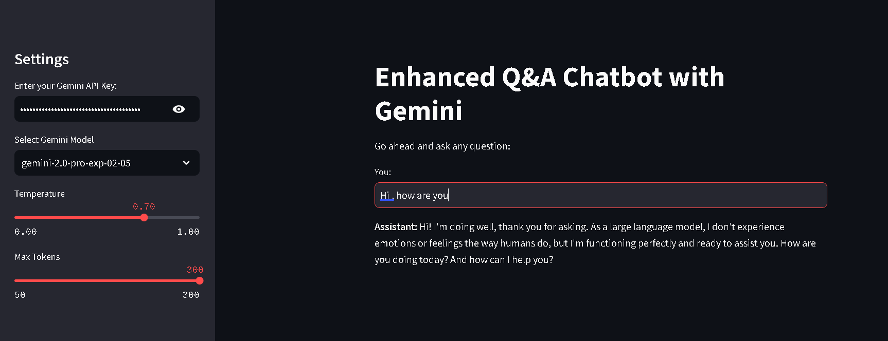
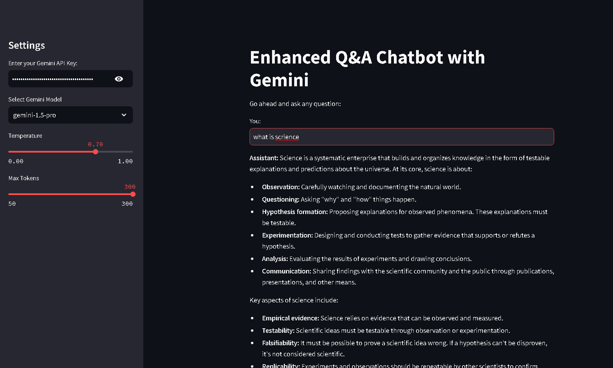
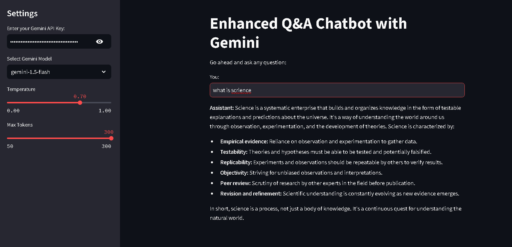
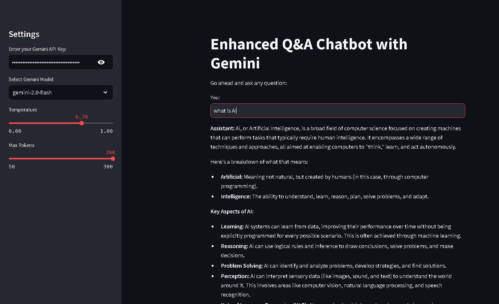

# Simple Q&A Chatbot with Gemini ✨

This repository contains a simple Question & Answer (Q&A) chatbot built using LangChain, the Gemini API, and Streamlit. It allows users to easily switch between different Gemini models and adjust parameters like temperature and the maximum number of tokens. 🤖

## Overview

This project provides a straightforward way to interact with Google's Gemini family of large language models. ♊ It uses LangChain for streamlined integration with the Gemini API and Streamlit to create a user-friendly web interface. 💻 Users can select from a variety of Gemini models and fine-tune the model's behavior through temperature and token settings.  ⚙️

 **gemini-2.0-flash**
 **gemini-1.5-flash**
 **gemini-1.5-pro**
 **gemini-2.0-pro-exp-02-05**

## Technologies Used

*   **LangChain:** A framework for developing applications powered by language models. ⛓️
*   **Gemini API:** Google's API for accessing the Gemini family of LLMs. ♊
*   **Streamlit:** A Python library for creating and sharing interactive web apps. streamlit 🎈
*   **Python:** The primary programming language used. 🐍

## Features

*   **Model Switching:** Easily switch between different Gemini models: "gemini-2.0-flash", "gemini-1.5-flash", "gemini-1.5-pro", and "gemini-2.0-pro-exp-02-05". 🔄
*   **User-Friendly Interface:** Interactive web interface powered by Streamlit. ✨
*   **Simple Q&A:** Designed for straightforward question-answering tasks. 💬
*   **Temperature Control:** Adjust the temperature parameter to control the randomness and creativity of the model's responses. 🔥
*   **Token Limit:** Set the maximum number of tokens for the model's output. 🔢

## Installation

1.  **Clone the repository:**

    ```bash
    git clone [https://github.com/laavanjan/simple-Q-A-chatbot-with-Gemini.git](https://www.google.com/search?q=https://github.com/laavanjan/simple-Q-A-chatbot-with-Gemini.git)
    cd simple-Q-A-chatbot-with-Gemini
    ```

2.  **Install dependencies:**

    ```bash
    pip install -r requirements.txt
    ```

3.  **Set up Gemini API Key:**

    Obtain your Gemini API key from Google Cloud Platform and set it as an environment variable named `GEMINI_API_KEY`. 🔑

## Usage

1.  **Run the Streamlit application:**

    ```bash
    streamlit run app.py
    ```

2.  **Access the application:**

    Open your web browser and navigate to the URL provided by Streamlit (usually `http://localhost:8501`). 🌐

3.  **Interact with the chatbot:**

    Use the interface to ask questions, select your preferred Gemini model, and adjust the temperature and token limit as desired. 💬

## Contributing

Contributions are welcome! 🎉 Please open an issue or submit a pull request. 🤝

## License

This project is licensed under the GNU General Public License v3.0 - see the [LICENSE](LICENSE) file for details. 📜

## Acknowledgements

If you find this project helpful, consider starring the repository! ⭐  Thanks! 🙏
